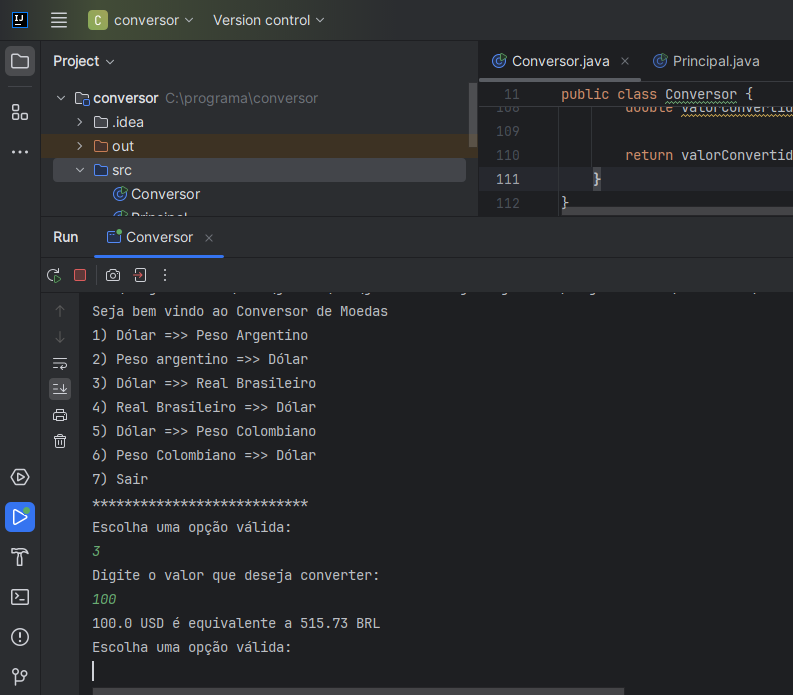

# Conversor de Moedas em Java

Este é um simples projeto em Java para converter entre diferentes moedas. Ele usa a API de taxa de câmbio para obter as taxas de conversão atualizadas.

## Funcionalidades

- Conversão entre Dólar e Peso Argentino
- Conversão entre Peso Argentino e Dólar
- Conversão entre Dólar e Real Brasileiro
- Conversão entre Real Brasileiro e Dólar
- Conversão entre Dólar e Peso Colombiano
- Conversão entre Peso Colombiano e Dólar

## Pré-requisitos

- Java 8 ou superior instalado
- Conexão com a internet para obter as taxas de conversão da API

## Como Usar

1. Clone este repositório para o seu computador.
2. Abra o projeto em sua IDE Java favorita.
3. Compile o projeto e execute a classe Conversor.java.
4. Siga as instruções exibidas no console para selecionar as opções desejadas e inserir o valor a ser convertido.

## Contribuindo

Se você quiser contribuir para este projeto, siga as etapas abaixo:

1. Fork o projeto.
2. Crie uma nova branch (`git checkout -b feature/nova-feature`).
3. Faça commit das suas alterações (`git commit -am 'Adicionando uma nova feature'`).
4. Faça push para a branch (`git push origin feature/nova-feature`).
5. Crie um novo Pull Request.
